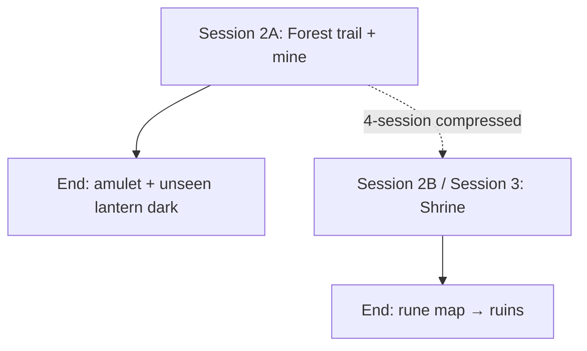

# Session 2 scenes draft: When the Lanterns Fall Silent

> Draft planning document. Scene outline only — not final `dm-script` content.
> Sources: `docs/TEMP-campaign-when-lanterns-fall-silent.md`, Session 1
> dm-script (`12_forest_edge_closing` through `09_herbalist_house`), and
> `docs/session-1-scene-coverage-when-lanterns-fall-silent.md` §4 defaults.

## Session 2 intent

Session 2 picks up **on the old forest trail** where Session 1 ended. The party
leaves Briarford's hireling comfort zone and learns the forest problem is **lethal
and layered** — not thieves, not rats, not porch pranks.

**5-session track (recommended):** Run **coal mine only**. End on the amulet
cold-pull cliffhanger. Shrine is Session 3.

**4-session track (compressed):** Mine + shrine in one long night if the table
moves fast and you trim optional mine rooms.

By the end of **mine-only Session 2**, players should:

1. Feel the forest trail is dangerous (volunteer bodies, wrong lights).
2. Understand the main city road is **not** the solution vector.
3. Reach the coal mines via **Mara Kell's notes** and Fenwick's margin sketch.
4. Discover goblins have returned after a long absence — panicked, not invading.
5. Rescue surviving miners (or mourn them) in a beginner-friendly crawl.
6. Defeat or drive off a goblin leader preaching doom fragments.
7. Find the **wizard-made amulet** — cold, old, not goblin craft.
8. Leave with a clear pull toward the **old shrine** (Session 3) without visiting it yet.

Keep **bound souls** and the necromancer as DM truth. Players see: blue pulse,
prophecy bark, spear-displayed bodies, blue-edged mine lantern, amulet pull.

---

## Carry-forward from Session 1

| Session 1 asset | Where earned | Session 2 use |
|-----------------|--------------|---------------|
| **Fenwick's trail sketch** | `11_mayor_followup` | Margin **"Silas X"** and **"mine?"** — compass, not GPS |
| **Silas diary excerpt** | `09_herbalist_house` | "Source not in village" — validates leaving the road |
| **Volunteer initials J.R., S.M., P.L.** | `06`, `07` | Match carved gear / bodies near mine |
| **Mara Kell tracks** | `10_mill_rat_problem` (optional) | Chalk tick → same trail mouth; **her notes found Session 2** |
| **Old mine lantern** | `10` (optional) | Rechargeable `light_cantrip_evocation`; coal-mark scratches pay off at mine |
| **Intro threads** | `01`–`05` | Breath-pulse, divine pull, cat compass — optional color on trail |
| **5 gp each partial pay** | `11` | Stakes; Alden still owes resolution bonus |
| **Closing image** | `12` | Blue light ahead — **do not resolve source**; trail travel opens Session 2 |

**Session 2 entry state:** Predawn or early morning on the **old forest trail**.
Party rested at **The Hearth & Horn** unless table rushed `12` same night.

---

## Track split (read this first)



| Block | 5-session track | 4-session track | Stop point |
|-------|-----------------|-----------------|------------|
| Forest trail + fork | Session 2 open | Session 2 open | — |
| Volunteer remains | Session 2 | Session 2 | — |
| Coal mine crawl + boss | Session 2 | Session 2 | **5-track: END here** |
| Forgotten shrine | **Session 3** | Same night as mine | Rune map revealed |

**Mine-only closing image (5-track stop):**

> The last goblin falls. The rescued miners whisper prayers. In your hand, the
> strange amulet turns cold, and somewhere deeper in the forest, an unseen
> lantern goes dark.

---

## Scene list

### Scene 0 — Session 2 framing and trail travel

**Type:** Table framing · travel montage · **Pacing:** ~10–15 minutes

**Purpose:** Bridge Session 1 cliffhanger to actionable forest play. Recap
hireling status, confirm what they carry, establish **first hour on the trail**
without a new investigation loop.

**Proposed slug:** `13_session_2_framing`

**Draft notes:**

- Open **one step past** `12` closing — blue light still ahead, not reached.
- Short recap prompt: *volunteers, Silas, Mara, diary, Fenwick's sketch*.
- **No initiative** at the answering blue light — it **retreats** or **winks out**
  when approached (soul-lantern behaviour; do not explain).
- Travel color: briars, coal-smell on the wind, distant crow silence.
- Ginger tom (`14_ginger_tom_cat`) may tag along if befriended in `05` — comic
  beats only.

**Checks (optional color):**

| Roll | DC | Detail |
|------|-----|--------|
| **Survival** | 11 | Stay on Silas/Mara trail without losing the sketch landmark |
| **Perception** | 12 | Three blue flickers **parallel** the party — not circling |
| **Religion / Arcana** | 13 | Pulse matches Session 1 breath-rhythm (Elias/Lilith callback) |

**Ends when:** Party reaches the **path fork** (`14`) — roughly 1–2 hours in-fiction.

---

### Scene 1 — Forest path fork: road vs mine

**Type:** Navigation decision · **Pacing:** ~10–15 minutes

**Purpose:** Teach that the **main forest road toward Ashmere** is a red herring.
Point toward coal mines via **Mara's dropped notes**, tracks, and blue lights.

**Proposed slug:** `14_forest_path_fork`

**Read-aloud seed:**

> The trail widens where an older **coal road** cuts across the forest track.
> Wheel ruts lead east — toward the city. Fresh **small clawed prints** and a
> scrap of oiled leather mark the north bend, where the pines grow black.

**Ways to point north (need any 2):**

| Source | Clue |
|--------|------|
| **Fenwick's sketch** | Margin **"mine?"** beside forest trail |
| **Mara's notes** (found here or at fork post) | See excerpt below |
| **Survival / Perception** | Prints too small for wolves; boot line overlaps Mara's size |
| **Blue lantern flicker** | Between pines on the **mine** bearing, not the road east |
| **Silas diary callback** | "When forest lights gathered near the old trail" |

**Mara Kell note excerpt (handout — waterproof wrap on a trail post or in a tin):**

> Tracks behind the mill are wrong. Too many small feet. Not rats, not children.
> Old prints near the coal road too.
>
> Lantern-light seen between the pines, but no human steps beside it.
>
> Coal mine first. Shrine after, if I still have daylight.

**Decision:**

- **East (main road):** Faster travel, wrong problem — optional **single** scene of
  ordinary traffic / toll-house distance before doubling back, or soft gate with
  Survival DC 12 "this smells like city mud, not coal."
- **North (mine road):** Correct vector — proceed to `15` / `16`.

**Ends when:** Party commits to the **mine bearing**.

---

### Scene 2 — Volunteer remains

**Type:** Discovery beat · horror without combat · **Pacing:** ~10 minutes

**Purpose:** Pay off Session 1 volunteer layer. Raise stakes before mine entrance.
Connect J.R. / S.M. / P.L. initials to **named bodies**.

**Proposed slug:** `15_volunteer_remains`

**Placement:** En route to mine mouth **or** 50–100 yards before entrance —
not inside goblin-held tunnels (goblins did not drag them deep).

**Read-aloud seed:**

> Three shapes off the path — wrong angles, wrong stillness. Bedroll straps,
> guild-stamped chits, Briarford clay on their boots. The forest is quiet
> around them.

**Default volunteer identities (match Session 1 initials):**

| Initials | Full name | Gear tell |
|----------|-----------|-----------|
| **J.R.** | **Jonas Reed** | Bedroll strap matches `06` hall prop |
| **S.M.** | **Sera Marsh** | Cheap shortsword, city mercenary patch |
| **P.L.** | **Pell Linden** | Clerk's ink-stained satchel; copied Silas map |

**Investigation beats:**

| Roll | DC | Reveal |
|------|-----|--------|
| **Medicine** | 10 | Dead **2–4 days** — before party took the job |
| **Investigation** | 11 | No looting — killed **fast**; claw and spear wounds |
| **Insight** | 10 | They died **running toward** the mine, not fleeing it |

**Contingencies:**

- If Session 1 skipped volunteer clues: initials still on gear — Fenwick's names
  in `11` retroactively match.
- Do **not** run combat here — predators already gone.
- Allow brief roleplay — Mordain, Vex, Ruta each get a hook if they share intro
  threads.

**Ends when:** Party acknowledges danger and continues to mine entrance.

---

### Scene 3 — Coal mine entrance

**Type:** Investigation · first combat tease · **Pacing:** ~15–20 minutes

**Purpose:** Establish mine set-piece, goblin presence, **blue-edged broken
lantern**, impaled miner display. First goblin scouts optional.

**Proposed slug:** `16_coal_mine_entrance`

**Read-aloud (campaign image):**

> The trees thin around a black wound in the hillside. The mine entrance stands
> half-collapsed, its support beams hacked and splintered. A few miners have been
> piled on crude improvised spears, their lanterns broken at their feet.

**Investigation details:**

| Roll | DC | Reveal |
|------|-----|--------|
| **Investigation** | 10 | Spears are **warning display**, not battlefield |
| **Survival** | 11 | Small clawed prints; **many**; recent |
| **Arcana / Perception** | 12 | Broken mining lantern — faint **blue edge** before dark |
| **History** | 11 | Goblins not seen in Briarford region for **generations** |

**Optional encounter:** 2 **goblin scouts** arguing over stolen food — flee toward
`17` if one escapes (noise alarm in crawl).

**Mara Kell layer (choose one):**

| Placement | Detail |
|-----------|--------|
| **Near entrance** | Boot prints deeper than volunteers — Mara **entered** mine |
| **Inside storage (`17`)** | Her **chalk arrows** on beams — still missing |
| **Grim** | Body in side tunnel — only if table wants harder tone; default **missing** |

**Ends when:** Party enters mine or establishes camp at mouth (push inside).

---

### Scene 4 — Mine crawl

**Type:** Exploration · 1–2 short combats · trap · **Pacing:** ~45–60 minutes

**Purpose:** Teach **darkvision, light, cover, helping ally** in a constrained
space. Rescue hook for trapped miners.

**Proposed slug:** `17_mine_crawl`

**Areas (run 3–4 if time short):**

| # | Area | Beat |
|---|------|------|
| 1 | **Entrance tunnels** | Broken carts, coal dust; scout fight or evidence of flight |
| 2 | **Collapsed side shaft** | Trapped miner **voices** — Athletics DC 12 or tools; noise risk |
| 3 | **Lantern gallery** | Hanging lanterns flicker **blue** when goblins near — teach light |
| 4 | **Storage room** | Rope, lamp oil, frightened miner hiding; Mara's chalk mark |
| 5 | **Deep work chamber** | Merge with `18` if pacing tight |

**Encounters (pick 2):**

- 2 goblin scouts (arguing / fleeing)
- Simple trap: tripwire + falling coal basket (Perception DC 12 / Thieves' tools)
- Blocked passage — Athletics DC 13 or clever tool use
- 3–4 goblins guarding a side room — **not** the leader

**Captured / trapped miners say:**

- Goblins came through an **old lower breach** — not the main village road
- Leader kept shouting **doom**, **debt**, **"dead light"**
- One goblin carried an amulet the others **would not touch**
- Something **older** than goblins may have driven them south (fear only)

**Skip list if table is slow:** Drop area 2 **or** merge gallery + storage.

**Ends when:** Party reaches deep chamber approach (`18`).

---

### Scene 5 — Goblin leader and rescued miners

**Type:** Boss fight · social optional · **Pacing:** ~30–40 minutes

**Purpose:** Climactic Session 2 combat. Panicked fanatic, not warlord. Miners
alive or dead based on table speed.

**Proposed slug:** `18_goblin_leader_chamber`

**Leader personality:**

- Panicked prophet — broken threats, prophecy fragments
- Not tactically clever — fights from fear

**Sample lines:**

- "Stone-roots crack. Mountain-home screams."
- "Dead light wakes. Dead king calls."
- "You kill me, doom still walks."
- "Lanterns go quiet. Then bones remember."

**Stat block (author when writing):**

- Reskin **Goblin Boss** (MM) or **Bugbear** down-tiered for 4–5 level-1 PCs
- 2–3 regular **Goblins** unless party already spent resources
- Proposed monster slug: `05_goblin_doom_speaker_monster`

**After defeat:**

- Strange **amulet** on leader's neck — others flinched from it
- **2–3 living miners** if party pushed through crawl in reasonable time
- Goblin survivors flee **deeper** or into forest — do not pursue to second dungeon

**Ends when:** Leader defeated or driven off; amulet in hand.

---

### Scene 6 — Amulet discovery and mine debrief (Session 2 end)

**Type:** Investigation · session outro · **Pacing:** ~15 minutes

**Purpose:** Reward mine victory, raise questions, **stop** 5-track Session 2.
Point to shrine without running it.

**Proposed slug:** `19_mine_amulet_closing`

**Amulet description:**

- Dark stone or old bone, runes too precise for goblins
- Cold near fire; lantern-without-flame or skull-in-lantern motif
- Faint pull **deeper forest** (shrine / ruins vector)

**Checks:**

| Skill | DC | Reveal |
|-------|-----|--------|
| **Arcana** | 12 | Necromancy / binding undertone — old craft |
| **History** | 11 | Pre-village style; **circle** workshop, not goblin |
| **Religion** | 11 | Warning against restless dead |
| **Investigation** | 10 | Carried recently; made long ago |

**Herbalist pull (no shrine visit yet):**

- Amulet pull matches **Silas's shrine notes** in diary margin if copied
- Mara's note: **"Shrine after, if I still have daylight"**
- Fenwick's folklore margin: *"Dead light sees the road"* — shrine verse

**Miner debrief:** Goblins fled **south** from northern mountains; "doom servants"
(name unknown) — symptom, not final enemy.

**5-track closing image (verbatim stop):**

> The last goblin falls. The rescued miners whisper prayers. In your hand, the
> strange amulet turns cold, and somewhere deeper in the forest, an unseen
> lantern goes dark.

**Hold there.** Shrine, herbs, riddle, rune map = Session 3 (`20`–`22`).

---

## Session 3 preview (shrine — out of Session 2 scope)

Draft slugs for the **next** authoring pass — do not run in 5-track Session 2:

| Scene | Proposed slug | Content |
|-------|---------------|---------|
| Shrine approach | `20_forgotten_shrine_approach` | Travel from mine camp; Silas herb notes |
| Herbs + riddle | `21_shrine_herbs_and_riddle` | Silverleaf, poison risk, weapon blessing |
| Rune map | `22_shrine_rune_map` | Map to necromancer ruins; Session 3 end |

See campaign draft § Old Forgotten Shrine for herb/riddle/map detail.

---

## Recommended table order

**5-session track (default):**

1. `13_session_2_framing` — trail travel, blue light retreats
2. `14_forest_path_fork` — Mara's notes, mine bearing
3. `15_volunteer_remains` — J.R. / S.M. / P.L. bodies
4. `16_coal_mine_entrance` — horror image, investigation, optional scouts
5. `17_mine_crawl` — 3–4 areas, trapped miners, short fights
6. `18_goblin_leader_chamber` — boss + rescue
7. `19_mine_amulet_closing` — amulet checks, debrief, **stop**

**4-session compressed:** Add `20`–`22` same night after a **5-minute** break.

---

## Draft pacing notes

- Session 2 is the **first real dungeon** — budget **2.5–3.5 hours** mine-only.
- If Session 1 ran long, trim `17` to three areas and skip optional scout fight at entrance.
- **Light:** Party may have torches from `11`, optional mill lantern, cantrip light —
  teach that darkness matters but do not TPK from no darkvision.
- **Level:** Stay at **1** through mine; level-up remains Session 5 open per campaign.
- **Goblins** are afraid refugees — allow parley with extreme difficulty; combat is default.
- **Amulet** raises questions only — no Guild, no soul reveal, no necromancer name.
- **Mara Kell** default: still **missing** at mine end; finding her alive is Session 3+ option.
- **Silas Thornwick** — no appearance; diary + shrine route is enough foreshadow.

---

## Proposed `dm-script-index.json` additions

Append after `12_forest_edge_closing`:

```json
[
  "13_session_2_framing",
  "14_forest_path_fork",
  "15_volunteer_remains",
  "16_coal_mine_entrance",
  "17_mine_crawl",
  "18_goblin_leader_chamber",
  "19_mine_amulet_closing"
]
```

Session 3 shrine block (later):

```json
[
  "20_forgotten_shrine_approach",
  "21_shrine_herbs_and_riddle",
  "22_shrine_rune_map"
]
```

---

## Registry prep (`names/names-index.json`)

**Add before UA translation:**

### NPCs

| Proposed slug | EN name | Notes |
|---------------|---------|-------|
| `jonas_reed` | Jonas Reed | Volunteer J.R.; bedroll in `06` |
| `sera_marsh` | Sera Marsh | Volunteer S.M. |
| `pell_linden` | Pell Linden | Volunteer P.L.; map copier |
| `skrit_ironwhine` | Skrit Ironwhine | Goblin doom-speaker leader (optional name) |

### Locations

| Proposed slug | EN name | Notes |
|---------------|---------|-------|
| `briarford_coal_mines` | Briarford coal mines | Mine entrance / crawl |
| `forgotten_shrine` | forgotten shrine | Session 3 — register now for Mara's note |
| `coal_forest_road` | coal forest road | Fork east toward Ashmere |

### Deferred (Session 3+ / part 2)

Guild of Magic, doom servants, necromancer name, ruin proper name.

---

## Monster / item authoring backlog

| Asset | Proposed slug | Notes |
|-------|---------------|-------|
| Goblin scout | `05_goblin_scout_monster` | MM Goblin — cosmetic coal dust |
| Goblin doom-speaker (leader) | `06_goblin_doom_speaker_monster` | Reskin Goblin Boss |
| Strange amulet | `01_strange_carved_amulet_uncommon_wondrous` | Investigate object; part 2 guild hook |
| Blue-edged mine lantern | prose / handout only | Matches `10` mill reward; not required magic item |

Run `scripts\build-sources.cmd --sync-items` / `--sync-spells` when stubs exist.

---

## Open prep decisions (with defaults)

| Decision | Open question | **Default for authoring** |
|----------|---------------|---------------------------|
| **Volunteer full names** | Bodies at mine | **Jonas Reed, Sera Marsh, Pell Linden** |
| **Mara at mine** | Alive, dead, or missing? | **Missing** — notes + chalk; rescue optional in Session 3 |
| **Goblin leader name** | Named or role only? | **Skrit Ironwhine** — DM can stay generic in read-aloud |
| **Mine name** | Proper noun | **Briarford coal mines** |
| **Shrine in Session 2?** | Combined or split? | **Split** — shrine is Session 3 (`20`–`22`) |
| **Main road fork** | Punish wrong turn? | **Soft gate** — one scene max, then loop back |
| **Miner survivors** | Count | **2–3** if crawl completed under ~90 min |
| **Prophecy couplet** | Canonical goblin chant? | Use leader sample lines; full prophecy = part 2 |
| **Combat tuning** | CR for 4–5 L1 PCs | 3–4 goblins total across crawl + 1 boss + 2 adds |

---

## Session 1 → Session 2 clue payoff matrix

| Session 1 clue | Session 2 payoff scene |
|----------------|------------------------|
| Volunteer bedroll J.R. | `15` — Jonas Reed body |
| Post initials J.R./S.M./P.L. | `15` — gear confirmation |
| Fenwick **"mine?"** margin | `14` — fork validation |
| Silas diary forest lights | `14` — blue flicker bearing |
| Mara mill tracks | `14` — her note handout |
| Mill mine lantern scratches | `16` — blue edge lantern |
| **Dead light** verse (Mordain/Fenwick) | `18` — goblin leader lines |
| `12` blue light answers | `13` — retreats, does not fight |

---

## Recommended next steps (authoring)

1. **Add `13_session_2_framing`** — bridge from `12`; no combat.
2. **Add `14_forest_path_fork`** — Mara note handout text; fork decision.
3. **Add `15_volunteer_remains`** — volunteer payoff; keep short.
4. **Author mine block `16`–`19`** — highest writing effort; boss + amulet end.
5. **Expand `names-index.json`** — volunteers, mine, shrine, goblin leader.
6. **Add goblin monster sheets** — scout + doom-speaker.
7. **Add amulet item stub** — sync from Shared/Items or scenario-local.
8. **Session 3 pass** — `20`–`22` shrine when mine playtests clean.

---

## Validation reminder

Before any commit (user skipped this turn):

```powershell
scripts\build-sources.cmd --validate-only
```

Spell closure: only cite `light_cantrip_evocation` by slug where mill lantern
recharge is referenced.
