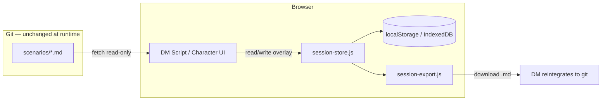

# TODO: Session notes & live play state

Status: **not started**  
Priority: **high** (core live-play workflow; blocks “use at the table” beyond read-only reference)  
Related: `Shared/Core/session-store.js` (new), `Shared/DmScript/dm-script-library.js`, `Shared/Characters/character-library.js`, `Shared/Core/book-nav.js`, `index.html`, [content-locales.md](./content-locales.md)

---

## Goal

Support **two live-play workflows** on top of the existing static DnD Book (local preview or GitHub Pages):

### DM workflow

- Host a session with the scenario open (`?scenario=<slug>&mode=dm`).
- Add **runtime notes** during play: player choices (killed NPC, talked down monster), loot given, plot deviations, reminders.
- Notes are anchored to **DM script scenes** (and optionally global session log).
- After the session, **export** notes into a markdown doc for later reintegration into campaign progress (git-authored content).

### Player workflow

- Open their character sheet (`?scenario=<slug>&mode=player&character=<slug>`).
- Track **mutable state** during play: HP, spell slots (○ markers), class resource uses, XP.
- Add **freeform session notes** (e.g. “met a weird lady — might be a witch”).
- Export personal session log for the player (optional share with DM).

**Constraint:** GitHub Pages is static — all runtime state is **client-side** unless a backend is added later. Authored markdown stays pristine; overlays are separate blobs.

---

## Current state (investigation)

### What exists

| Area | Today |
|------|--------|
| **Scenarios** | Folder per adventure; URL `?scenario=`, `?lang=`, `?mode=dm\|player` |
| **DM Script** | Paginated scenes (Summary, Read-aloud, Checks, Contingencies, DM Notes) — read-only |
| **Characters** | HP as string (`32`), spell slots as ○ rows (`.resource-uses` CSS), class resources with ○ |
| **DM / player mode** | Monsters & NPCs hide DM sections in player mode; characters/spells/items always strip DM notes |
| **Persistence** | None — no `localStorage`, `sessionStorage`, or IndexedDB in app code |
| **Export** | None |

### Gaps

| Gap | Impact |
|-----|--------|
| No session identity | Cannot distinguish “session 3” from “session 4” or multiple tabs |
| No editable UI | No textareas, toggles, or HP controls |
| HP / slots are display-only | ○ markers cannot be clicked; HP is not numeric |
| DM Script has no scratch pad | Natural place for scene notes is unused |
| No post-session export | Cannot form doc for campaign reintegration |
| `dmOnly` nav flag unused | DM Script visible to players in nav (content still readable) |
| No player character deep-link | Players must paginate to find their sheet |

---

## Proposed architecture

### 1. Session store (`Shared/Core/session-store.js`)

Central persistence keyed by **scenario + session id**:

```
dndbook:session:{scenarioSlug}:{sessionId}
```

**Session id sources (pick one default, support others):**

- Auto-generated on first edit (`crypto.randomUUID()`), stored in `sessionStorage` for tab scope
- Optional URL `?session=<id>` for bookmarking / sharing within a LAN (no auth)
- “New session” / “Resume last” controls in hub or section chrome

**State shape (versioned JSON):**

```json
{
  "v": 1,
  "createdAt": "2026-06-17T…",
  "updatedAt": "2026-06-17T…",
  "dm": {
    "globalNotes": "",
    "scenes": { "01_hook": "Players spared the goblin…" },
    "events": [
      { "at": "…", "scene": "01_hook", "type": "choice", "text": "…" }
    ]
  },
  "characters": {
    "02_elara_moonweaver_elf_wizard": {
      "hpCurrent": 24,
      "hpMax": 32,
      "xp": 6500,
      "slotsUsed": { "1": 2, "2": 1, "3": 0 },
      "resources": { "Arcane Recovery": true },
      "notes": "Weird lady at the mill — witch?"
    }
  }
}
```

Use **IndexedDB** if payload grows (long notes, many sessions); start with `localStorage` for simplicity.

### 2. DM: scene notes panel

**Where:** `dm-script-library.js` — below each rendered scene.

- Collapsible **“Session notes”** textarea (DM mode only).
- Optional quick-add chips: `Choice`, `Loot`, `NPC`, `Reminder` (prepend template line).
- **Global session log** tab or sticky footer for cross-scene notes.
- Persist on `input` (debounced) via `session-store`.
- URL `?scene=<slug>` syncs pagination + notes context.

### 3. Player: character overlay

**Where:** `character-library.js` — after `renderEntry()`, hydrate overlay.

| Control | Behavior |
|---------|----------|
| **HP** | Parse max from authored `**Hit Points HP:** 32`; show current/max with −/+ buttons |
| **Spell slots** | Replace ○ row with clickable circles (○ → ●); count per level from Slots row |
| **Class resources** | Toggle ○ on resource Uses column |
| **XP** | Optional numeric field (authored baseline + delta) |
| **Notes** | Textarea at bottom of card |

Overlay **never writes back** to `.md` files at runtime.

**Player UX:** `?character=<slug>` opens sheet directly; hide other characters or show picker.

### 4. Post-session export

**Where:** New `Shared/Core/session-export.js` + button in book chrome (DM: all notes; player: own character).

**DM export** → markdown file, e.g. `session-2026-06-17-test-adventure.md`:

```markdown
# Session notes — Test Adventure
**Date:** 2026-06-17 · **Scenario:** test-adventure

## Global
…

## Scene: 01_hook — Hook
…

## Character updates (reference)
- Elara: HP 24/32, 1st slots 2/4 used
```

**Player export** → `session-notes-elara-2026-06-17.md` (notes + state snapshot).

Download via `Blob` + `<a download>` — works on GitHub Pages and localhost.

**Reintegration path (manual, v1):** DM copies export sections into scenario markdown (`dm-script` contingencies, character HP, new `session/` log file in git). Future: `scripts/merge-session-notes.js` CLI.

### 5. Mode & nav enforcement

**Where:** `book-nav.js`

- Hide or disable `dmOnly` sections when `mode=player`.
- Add **Session** entry (optional v2): combined log view + export.
- Session notes UI visible only when `mode=dm` (DM notes panel) or on own character (player notes).

### 6. Data flow (mermaid)



---

## Implementation phases

### Phase 1 — Foundation (MVP)

- [ ] `Shared/Core/session-store.js` — get/set/patch, session id, `?session=` URL param
- [ ] Wire `session-store` in `library-shell.js` / `DnDCore` namespace
- [ ] DM Script: per-scene textarea + debounced save (DM mode only)
- [ ] “Export session notes” → single markdown download
- [ ] Basic styles in `book.css` (`.session-notes`, `.session-hp-controls`)

### Phase 2 — Player character state

- [ ] Parse HP max from combat section; HP current overlay
- [ ] Clickable spell slot circles (derive counts from Slots / Used rows)
- [ ] Class resource toggles
- [ ] Character notes textarea
- [ ] `?character=<slug>` deep link in `character-library.js`
- [ ] Player export (character snapshot + notes)

### Phase 3 — Session lifecycle UX

- [ ] Hub or nav: “Start session” / “Resume” / session date label
- [ ] Global DM log (not tied to one scene)
- [ ] Structured quick events (`type: choice|loot|npc`) for cleaner export
- [ ] Clear / archive session (with confirm)
- [ ] Enforce `dmOnly` sections in player mode

### Phase 4 — Polish & reintegration

- [ ] XP field + optional “level up” reminder in export
- [ ] Import session snapshot (read exported md or JSON) for resume on new device
- [ ] `scripts/merge-session-notes.js` or docs for manual campaign merge workflow
- [ ] Optional `scenarios/<slug>/session/` git-authored session archive section
- [ ] i18n labels for session UI (EN/UA)

### Out of scope (v1)

- Multi-device sync / shared DM–player state (needs backend or WebRTC)
- Editing authored markdown in-browser
- Initiative tracker, turn order, fog of war
- Automatic git commit of session exports

---

## Open questions

1. **Session scope:** One session per scenario per browser, or multiple archived sessions per scenario?
2. **Player identity:** Trust-based (anyone can open any character) or local “pick your character” lock?
3. **Export cadence:** Manual button only, or prompt on `beforeunload` if unsaved notes exist?
4. **Storage limit:** `localStorage` ~5MB — sufficient for text notes; switch to IndexedDB if adding attachments?

---

## Test plan

- [ ] DM: add scene note → refresh → note persists (same `?session=`)
- [ ] DM: export → markdown contains scene title + note body
- [ ] Player: spend 2× 1st-level slots → refresh → still spent
- [ ] Player: damage HP → export reflects current HP
- [ ] `mode=player`: DM Script nav hidden; character notes still work
- [ ] GitHub Pages: full flow without backend
- [ ] New `?session=` id → clean state (no bleed from prior session)
