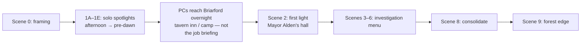

# Session 1 Scene Coverage Analysis

**Scenario:** `when-the-lanterns-fall-silent`  
**Date:** 2026-06-19 (UA locale pass)  
**Sources:** `docs/TEMP-session-1-scenes-when-lanterns-fall-silent.md` (scope authority), `docs/TEMP-campaign-when-lanterns-fall-silent.md`, `dm-script-index.json`, `docs/dm-script-branches.md`

---

## UA locale coverage (2026-06-19)

Full Session 1 dm-script Ukrainian coverage is **complete** for all 13 indexed slugs.

| Slug | EN | UA | Branches (EN→UA) | Agent | Notes |
|------|----|----|------------------|-------|-------|
| `00_session_framing` | ✓ | ✓ | 0 → 0 | T00 | Contract poster matches `01_intro_vex.ua.md` |
| `01_intro_vex` | ✓ | ✓ (refreshed) | 2 → 2 | R01 | Timeline: «Очаг і ріг» → `06` at first light |
| `02_intro_lilith` | ✓ | ✓ (refreshed) | 2 → 2 | R02 | Same timeline refresh |
| `03_intro_elias` | ✓ | ✓ (refreshed) | 2 → 2 | R03 | Same timeline refresh |
| `04_intro_mordain` | ✓ | ✓ (refreshed) | 2 → 2 | R04 | Same timeline refresh |
| `05_intro_ruta` | ✓ | ✓ (refreshed) | 0 → 0 | R05 | Cat hook → hall steps at `06` |
| `06_mayors_hall_convergence` | ✓ | ✓ | 2 → 2 | T06 | Largest group scene |
| `07_affected_homes` | ✓ | ✓ | 2 → 0 opts | T07 | **Маргарет** via `margaret_coyle` registry |
| `08_fake_lantern_house` | ✓ | ✓ | 2 → 3 opts | T08 | **бочарний провулок** via `coopers_lane` |
| `09_herbalist_house` | ✓ | ✓ | 2 → 2 opts | T09 | Diary excerpt translated |
| `10_mill_rat_problem` | ✓ | ✓ | 0 → 0 | T10 | Optional combat tutorial |
| `11_mayor_followup` | ✓ | ✓ | 2 → 0 opts | T11 | Forest commitment |
| `12_forest_edge_closing` | ✓ | ✓ | 0 → 0 | T12 | Session end |

**Names registry additions (A0):** `coopers_lane`, `margaret_coyle`.

**Validation:** Index validator reports 0 errors (Node unavailable in environment — spell/name closure scans not run; manual grep found no stray EN proper nouns except EN combat stat shorthand in `08` matching EN source, and map margin labels `Silas X` / `mine?` in `11`).

### Remaining gaps (out of scope for this pass)

| Layer | Status |
|-------|--------|
| **session-guides UA** | Intros `01`–`05` only — no guides for `00`, `06`–`12` |
| **character `*_intro.en.md`** | 5 EN one-pagers, no `.ua.md` |
| **Intro session-guides refresh** | `session-guides/*` may still reference old tavern-convergence beats |
| **PC names in registry** | Рута, Мордейн, Ліліт, Еліас used in UA prose but not in `names-index.json` (same as pre-pass intros) |
| **Campaign draft** | `TEMP-campaign` may still say tavern meeting — EN dm-script is canonical |

---

## Executive summary (historical EN authoring pass — 2025-06-19)

| Layer | Status (updated 2026-06-19) |
|-------|----------------------------|
| **Intros (1A–1E)** | **Complete** EN + UA; timeline drift **fixed** in UA |
| **Framing + group scenes (0, 2–9)** | **Complete** EN + UA — all in `dm-script-index.json` |
| **Timeline** | **Resolved** in EN and UA — overnight «Очаг і ріг», morning hall `06` |
| **Campaign draft** | Still may say tavern convergence; **dm-script supersedes** |

---

## 1. Scene inventory table

| Scene | Proposed / existing slug | Status | Gap vs outline | Cross-scene dependencies |
|-------|--------------------------|--------|----------------|--------------------------|
| **0** — Table framing & contract | `00_session_framing` | **Missing** | No shared handout scene, no “spotlights then morning hall” instruction, no contract paraphrase for table | Must match contract text in all intros; sets canonical timeline for 1A–1E exits and Scene 2 |
| **1A** — Vex | `01_intro_vex` ✓ | **Complete** (minor convergence drift) | Exit/DM Notes aim at **tavern** convergence, not overnight → morning hall. Otherwise: location, Tomas/inciting beat, Insight DC 12, Harry Potter exit, clue list, branch structure all present | Clues feed Scene 2 (contract recognition, name-whisper rumor, guild money); Scene 3 (compare rumor to physical traces); Scene 8 (Vex guarded if names mentioned) |
| **1B** — Ruta | `05_intro_ruta` ✓ | **Complete** (minor) | Survival listed as **optional** in file; outline pairs it with Perception as main reads. Exit to **tavern** not hall. Cat-on-steps hook is tavern porch, not hall steps | Animal-before-people clue → Scene 3; second out-of-sync lantern → Scenes 3–4; cat reappearance → Scene 2; city-boot tracks → cross-thread Vex |
| **1C** — Mordain | `04_intro_mordain` ✓ | **Complete** (convergence drift) | Outline exit: **mayor's hall at dawn**; file: **tavern dusk/evening**. Divine Sense, Insight, way-shrine phrase, desecrated path all present | Undead/desecration → Scene 3 Religion/Divine Sense; “dead light” → Scene 5 diary language; contrast with Lilith/Elias → Scene 2 |
| **1D** — Lilith | `02_intro_lilith` ✓ | **Complete** (convergence drift) | Exit to **tavern at first light** vs hall morning. Herb + Arcana/Investigation beats fully authored | Samples/notes → Scene 2 compare, Scene 3 Arcana; name-carrier wave → Scene 3; pulse-weed → optional later shrine echo |
| **1E** — Elias | `03_intro_elias` ✓ | **Complete** (convergence drift) | Exit to **tavern before dawn** vs hall morning. History/Arcana, peddler flare, wilderness memory all present | Breath-pulse + guild fees → Scene 2 records check; matches Lilith → Scene 2; “dead light” songs → Scene 5 |
| **2** — Mayor's hall convergence | `06_mayors_hall_convergence` | **Missing** | No Alden briefing, payment terms, rumor seeding, Insight-on-evasion, investigation menu, map writer, volunteer layer | Requires intro clue callbacks; branches to 3/4/5/6; embeds Scene 7 volunteer beats |
| **3** — Affected homes | `07_affected_homes` | **Missing** | No real-lantern physical evidence scene; no “compare intro clues” beat | Best after Scene 2; before or parallel Scene 4 (fake must not deflate mystery); tracks → Scene 8/9 |
| **4** — Fake lantern house | `08_fake_lantern_house` | **Missing** | No Bram/Tessa/Henk encounter, mechanism exposure, optional non-lethal fight | **After** Scene 3 (outline + campaign); thieves admit copying real forest-road behavior → Scene 8 pushback |
| **5** — Herbalist house & diary | `09_herbalist_house` | **Missing** | **Mandatory forest lead** absent; diary excerpt only in TEMP/campaign, not play content | Scene 8 minimum-clue gate; Session 2 shrine/mine hooks; volunteer stablehand rumor attaches here |
| **6** — Mill & rats *(optional)* | `10_mill_rat_problem` | **Missing** | No combat tutorial, hunter tracks, mine-lantern reward | Optional; hunter tracks satisfy Scene 8 forest-clue minimum; mine lantern → Session 2–4 darkness prep |
| **7** — Volunteer trail *(layer)* | *(no file)* | **Missing** (distributed) | No bedroll, initials, stablehand, or pressured Alden admission in play content | Parent scenes: 06, 07, 09, 11 — see §3 |
| **8** — Mayor follow-up & choice | `11_mayor_followup` | **Missing** | No consolidation, fake-thieves pushback, supplies/rest, forest commitment | Needs 2–3 forest clues from 3/5/6/7; leads to Scene 9 |
| **9** — Forest edge closing | `12_forest_edge_closing` | **Missing** | No closing read-aloud; no session-end momentum beat | After Scene 8 decision only; mirrors campaign Session 2 entry |

---

## 2. Intro scene audit (1A–1E)

### Canonical timeline recommendation

The **TEMP session outline** should govern table order:

**Conflict:** All five intros and the campaign draft’s “Opening Scene: Tavern Meeting” send PCs to **village tavern** with “Mayor Alden present or sent for.” The outline’s Scene 0 and Scene 2 place Alden at the **hall at first light** for the contract briefing.

**Recommended fix (editorial, not new content):**

- Intros end: *en route to Briarford / overnight lodging* — **not** the group briefing.
- Scene 0 explicitly states morning hall appointment.
- Scene 2 is the **first** time the full party and Alden meet for hire terms.
- Evening tavern beats (Ruta/Mordain “hearth lit”) become **travel color** or a single unnamed village inn — not the convergence scene.

| Intro | Outline beat | Satisfied? | Clues that must resurface in Scene 2+ | Missing / drift |
|-------|--------------|------------|---------------------------------------|-----------------|
| **1A Vex** (`01_intro_vex`) | Last Lamp; Tomas says “Vex”; Insight DC 12; flee as Harry Potter | **Yes** | Name-whisper rumor; guild/city money on contract; Ashmere/ledger thread; toll-road chit | **Convergence:** “tavern / Mayor Alden” → should be overnight only. Hall-door contract recognition hook for Scene 2 not explicit in exit (only “poster prop” DM note) |
| **1B Ruta** (`05_intro_ruta`) | Mossy clearing; cat + blue light; AH DC 11; Perception DC 12; comic tone | **Mostly** | Blue porch lantern; animals react first; city-boot tracks; optional second lantern | **Survival** demoted to optional vs outline “main.” **Cat on hall steps** → file says tavern porch. Exit venue drift |
| **1C Mordain** (`04_intro_mordain`) | Treeline dusk; symbol warms; Insight DC 12; optional Divine Sense; dawn + hall | **Mostly** | Non-ordinary blue flame; desecrated approach; undead tied to lantern; “Dead light sees the road” | **Exit:** tavern dusk/evening, not **hall at dawn**. DM Notes offer timing hand-wave — should be standardized |
| **1D Lilith** (`02_intro_lilith`) | Forest edge herb ring; flare + name whisper; Inv/Arcana harvest; samples to village | **Yes** | Herb reaction to blue light only; spike toward village; name-shaped pulse; optional second lantern | Exit to **tavern** not hall. `detect_magic` necromancy undertone is DM-only — fine for Session 1 |
| **1E Elias** (`03_intro_elias`) | Blue Wick; accounts + double blue flare; History DC 11 / Arcana DC 12; personal wilderness color | **Yes** | Breath-pulse witnesses; “dead light” journal; guild posting fees; optional name whispers | Exit to **tavern** not hall. Peddler unnamed — fine for one-off |

### Intro quality notes (branch markup)

All five files follow `docs/dm-script-branches.md`: `#### Branch A/B` under Checks, `**Option N**` sub-paths, shared tail prose (“Clues to carry…”, “Arriving in Briarford…”). No structural rework needed before writing group scenes.

### Clue convergence matrix (for Scene 2 authoring)

| Clue thread | 1A | 1B | 1C | 1D | 1E | Must appear in Scene 2+ |
|-------------|----|----|----|----|----|-------------------------|
| Blue porch lantern(s) | rumor | seen | seen | measured | read about | 2, 3, 9 |
| Name-shaped whisper | rumor | — | — | experienced | accounts | 2 rumors, 3 physical |
| Pulse like breath | — | — | optional | notes | accounts | 3, 5 diary |
| Animals react first | — | ✓ | — | — | — | 3 comparison beat |
| Undead / desecration | — | — | Divine Sense | — | — | 3 if Mordain shares |
| Guild/city money on contract | ✓ | ✓ | ✓ | ✓ | ✓ | 2 Investigation on board |
| Second out-of-sync lantern | — | optional | optional | optional | optional | 3, 4 (fake copied real) |
| “Dead light” folklore | — | — | verse | — | journal | 5, later shrine |

---

## 3. Missing-file plan

### New English dm-script files

| Scene | Proposed slug | Filename |
|-------|---------------|----------|
| 0 | `00_session_framing` | `00_session_framing.en.md` |
| 2 | `06_mayors_hall_convergence` | `06_mayors_hall_convergence.en.md` |
| 3 | `07_affected_homes` | `07_affected_homes.en.md` |
| 4 | `08_fake_lantern_house` | `08_fake_lantern_house.en.md` |
| 5 | `09_herbalist_house` | `09_herbalist_house.en.md` |
| 6 *(optional)* | `10_mill_rat_problem` | `10_mill_rat_problem.en.md` |
| 8 | `11_mayor_followup` | `11_mayor_followup.en.md` |
| 9 | `12_forest_edge_closing` | `12_forest_edge_closing.en.md` |

**Updated `dm-script-index.json` order (proposed):**  
`00_session_framing` → `01`–`05` intros → `06`–`12` as above (skip `10` if table skips mill).

### Scene 7 — volunteer trail (not standalone)

| Volunteer clue (outline) | Parent scene | Suggested placement |
|--------------------------|--------------|---------------------|
| Bedroll / unpaid contract fee left at hall | **`06_mayors_hall_convergence`** | Investigation on hall records or visible prop when PCs arrive |
| Alden admits volunteers asked about herbalist and/or hunter | **`06_mayors_hall_convergence`** | On Persuasion/Intimidation success or after Insight catches evasion |
| Stablehand saw them heading toward herbalist's home | **`09_herbalist_house`** | Neighbor/stable rumor during search; or brief NPC at herbalist lane |
| Initials or symbol on post near forest road | **`07_affected_homes`** | Forest-facing home or lane terminus; ties affected homes to volunteer path |
| “Previous group didn’t return” (rumor) | **`06_mayors_hall_convergence`** | Alden downplay + tavern-style rumors in hall waiting room |
| Reinforcement after investigation | **`11_mayor_followup`** | Alden or villager reacts once party has herbalist diary / tracks |

---

## 4. Enrichment backlog

Decisions still open in TEMP “Open prep notes” and campaign draft, with **recommended defaults** so writing can proceed:

| Decision | Open question | Recommended default |
|----------|---------------|---------------------|
| **Affected home names** | TBD until village map | **Two homes:** (1) **Wren Holloway’s cottage** — first forest-road lantern, door ajar; (2) **Tanner’s end cottage** (neighbor rumor only if time short). Both on “old road” edge |
| **Map writer at Scene 2** | Default presence vs on-request | **Present by default** — **Fenwick Cropp**, ink-stained clerk at hall with partial regional map; not a linguist; “bring me what you find in the woods” |
| **Mill in Session 1** | Run now vs save combat | **Optional** — include `10_mill_rat_problem` in index but mark Summary “skip if low on time”; Scene 2 offers mill as third menu option |
| **Rat stat block** | Simple beginner fight | **3× Giant Rat** (MM) with cosmetic glowing eyes; or **1 Swarm of Rats** for very small party. 15–20 min max |
| **Herbalist name** | Unnamed in campaign | **Silas Thornwick** — diary signed; missing; soul-lantern candidate later |
| **Hunter name** | Unnamed | **Mara Kell** — mill would have sent for her; notes discovered Session 2 |
| **Miller name** | Unnamed | **Garrick Moss** — worried, not combatant |
| **Fake lantern NPCs** | Placeholders exist | Use campaign names: **Bram Keswick** (ringleader), **Tessa Aldridge** (nervous neighbor), **Old Henk** (fence, cooper’s yard shed) |
| **Named missing → later lantern** | Which villager recurs | **Silas Thornwick** (herbalist) — strongest emotional through-line; Wren Holloway as optional affected-home lantern in Session 4 |
| **Starting level** | Level 1 vs other | **Level 1** — matches intro DCs, fistfight, rat tutorial; tune only if party size >5 |
| **City name** | TBD (Session 5) | **Ashmere** (already in Vex thread) as nearest city; defer Guild proper name to Session 5 |
| **Ginger tom** | Name? | Leave **unnamed** in EN; comic “the cat” — optional name when Ruta registers in Scene 2 |
| **Convergence venue** | Tavern vs hall | **Hall at first light** (outline); retcon intro exit prose in a later pass |
| **Tavern in Briarford** | Unregistered location | Name when needed: **The Hearth & Horn** — overnight lodging only, not briefing |
| **Volunteer group identity** | Names on bodies Session 2 | **Three volunteers:** initials **J.R., S.M., P.L.** carved on forest-road post; full names on Session 2 bodies |
| **Party size** | Manifest TBD | Write scenes for **4–5 PCs** (current intros); scale rat count ±1 |

---

## 5. Registry prep list (`names/names-index.json`)

**Already registered:** Briarford, The Last Lamp, The Blue Wick, Mayor Alden, Vex, Ashmere lot.

**Add before UA translation** (EN authoring can use these names now):

### NPCs

| Proposed slug | EN name | Type | Notes |
|---------------|---------|------|-------|
| `tomas_grull` | Tomas Grull | npc | Vex intro; road-only |
| `mira` | Mira | npc | Last Lamp barkeep |
| `corwin` | Corwin | npc | Blue Wick innkeeper |
| `fenwick_cropp` | Fenwick Cropp | npc | Map writer / clerk |
| `silas_thornwick` | Silas Thornwick | npc | Missing herbalist |
| `mara_kell` | Mara Kell | npc | Missing hunter |
| `garrick_moss` | Garrick Moss | npc | Miller |
| `bram_keswick` | Bram Keswick | npc | Fake-lantern ringleader |
| `tessa_aldridge` | Tessa Aldridge | npc | Fake-lantern accomplice |
| `old_henk` | Old Henk | npc | Fence |
| `wren_holloway` | Wren Holloway | npc | Affected-home missing villager (default) |

### Locations / organizations

| Proposed slug | EN name | Type | Notes |
|---------------|---------|------|-------|
| `mayors_hall` | Mayor Alden's hall | location | Village hall / public room |
| `the_hearth_and_horn` | The Hearth & Horn | tavern | Briarford inn (overnight lodging) |
| `silas_thornwicks_house` | Silas Thornwick's house | location | Herbalist home |
| `garrick_moss_mill` | Garrick Moss's mill | location | Mill scene |
| `coopers_yard` | Cooper's yard | location | Old Henk stash |
| `briarford_toll_house` | Briarford toll-house | location | Vex ledger thread |
| `old_forest_trail` | old forest trail | location | Recurring path name |
| `ashmere` | Ashmere | settlement | Nearest city (if distinct from “Ashmere lot”) — confirm not duplicate org |

### PC public alias

| Proposed slug | EN name | Type | Notes |
|---------------|---------|------|-------|
| `harry_potter` | Harry Potter | pc | Vex public name; register if UA prose must not use EN |

### Deferred (Session 2+ / part 2)

Guild of Magic, doom servants, necromancer name, city guild formal name, forgotten shrine, coal mines — not required for Session 1 EN dm-script.

---

## Recommended next steps

1. **Add Scene 0** — locks timeline and contract handout before intros.
2. **Light edit intros** — replace “tavern convergence” exits with “overnight in Briarford → morning hall”; keep tavern as lodging color only.
3. **Author Scene 2 (`06`)** — highest priority; embeds volunteer layer and investigation menu.
4. **Author Scene 5 (`09`)** — mandatory diary; attach stablehand volunteer clue.
5. **Author Scenes 3, 4, 8, 9** — investigation loop and session end.
6. **Optional Scene 6 (`10`)** — when table wants combat tutorial.
7. **Expand `names-index.json`** — batch add §5 entries before any `.ua.md` work.
8. **Update campaign draft** — align “tavern meeting” with hall convergence to stop future drift.
